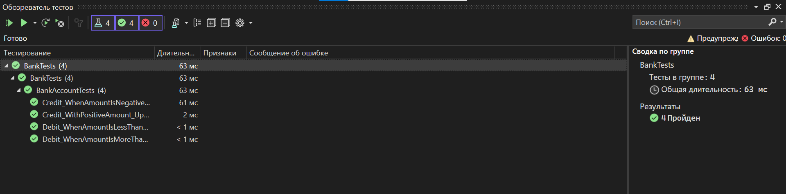

# Описание изменений и тестирования
## Причины неуспешного выполнения тестов
### Ошибка в логике списания средств
- **Ошибка:** Вместо вычитания суммы списания из баланса (`m_balance -= amount`), код ошибочно увеличивал баланс (`m_balance += amount`).
- **Последствие:** После операции списания баланс счета увеличивался, а не уменьшался.
---
## Причины успешного выполнения тестов
### Надежные тесты
1. **Перехват исключений:**
   - Блок `try/catch` гарантирует корректный перехват исключений.
2. **Проверка сообщений об ошибках:**
   - `StringAssert.Contains` проверяет соответствие текста ошибки ожидаемому сообщению.
3. **Контроль выброса исключений:**
   - `Assert.Fail` срабатывает, если исключение не было выброшено в ожидаемых сценариях.
### Рефакторинг кода
1. **Централизация сообщений:**
   - Константы для сообщений об ошибках вынесены в отдельный класс, что упрощает их управление.
2. **Исправление критических ошибок:**
   - Устранена ошибка в методе `Debit`, где баланс не уменьшался при списании средств.
   ---

